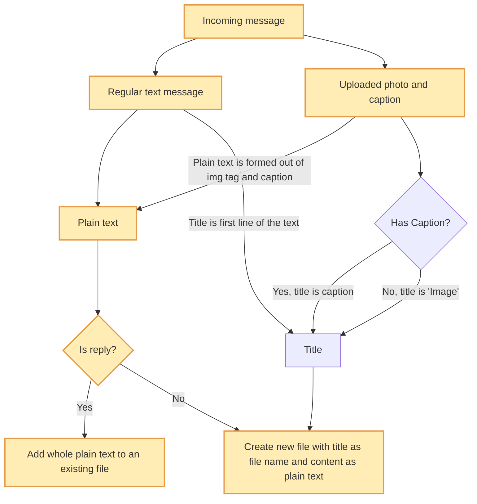

# How we process incoming messages

```mermaid
graph TB;
%% Define class for central elements
classDef main fill:#FFEDB5,stroke:#E69A45,stroke-width:2px;
%% Define class for aside elements
classDef asideElement fill:#B3D7E8,stroke:#7F8C8D,stroke-width:2px;

%% Centralizing main elements with color
Msg[Incoming message]:::main --> TextMsg[Regular text message]:::main
Msg --> Photo[Uploaded photo and caption]:::main
TextMsg --> PlainText[Plain text]:::main
Photo --> |Plain text is formed out of img tag and caption| PlainText:::main

%% Aside elements with different color
Photo --> HasCaption{Has Caption?}:::asdie
HasCaption --> |Yes, title is caption| Title:::aside
HasCaption --> |No, title is 'Image'| Title:::asdie

PlainText --> IsReply{Is reply?}:::main
IsReply --> |Yes| AddContent[Add whole plain text to an existing file]:::main
IsReply --> |No| CreateFile[Create new file]:::main
TextMsg --> |Title is first line of the text| Title:::aside
Title --> CreateFile[Create new file with title as file name and content as plain text]:::mainElement

```

